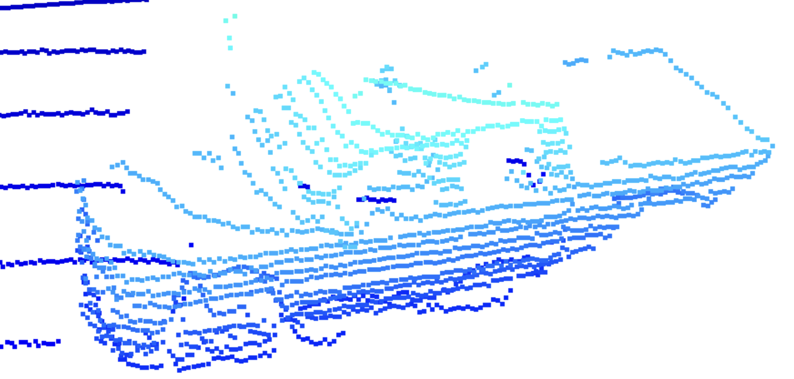

# Writeup: Track 3D-Objects Over Time

## 1. Visualize point-cloud (ID_S1_EX2)

- Find 10 examples of vehicles with varying degrees of visibility in the point-cloud
  
  
  
  
  
  
  
  
  
  
  

- Try to identify vehicle$ $ features that appear stable in most of the inspected examples and describe them
  
  - Every vehicle has a wheel around the bottom part.
  
  - All vehicles are rectangular in shape with one side longer than the other.
  
  - Even though the vehicle is square in overall shape, the corners are always rounded.
  
  - The upper part of the vehicle has a window that appears white because the laser does not reflect it.
